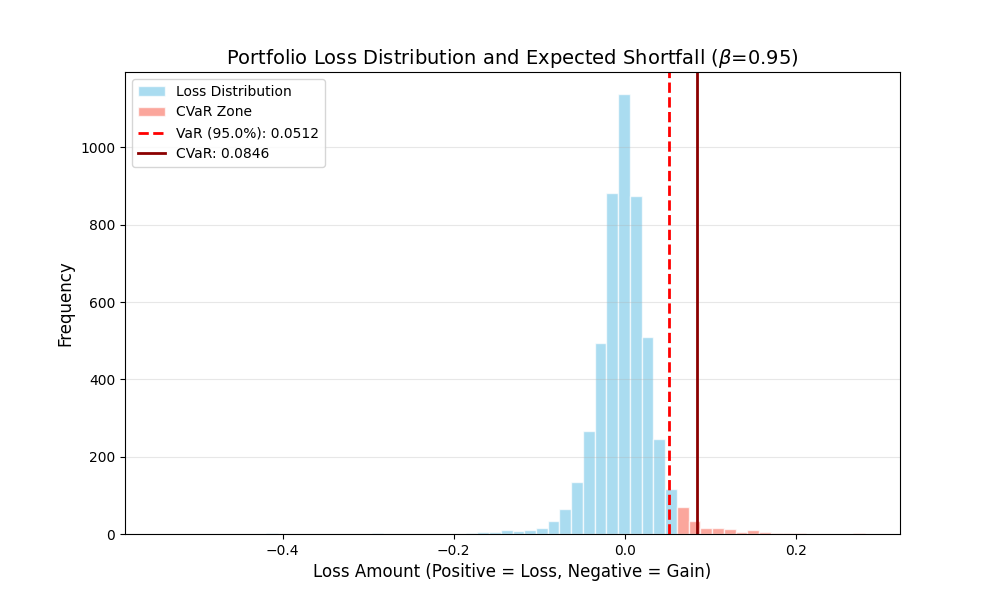
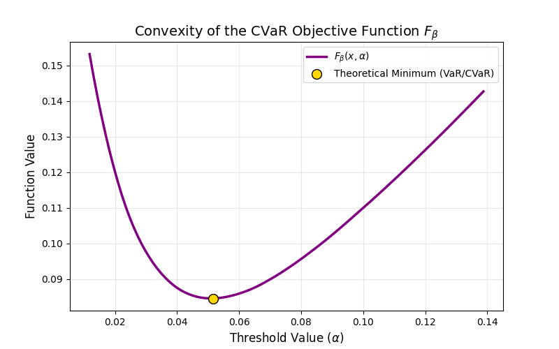
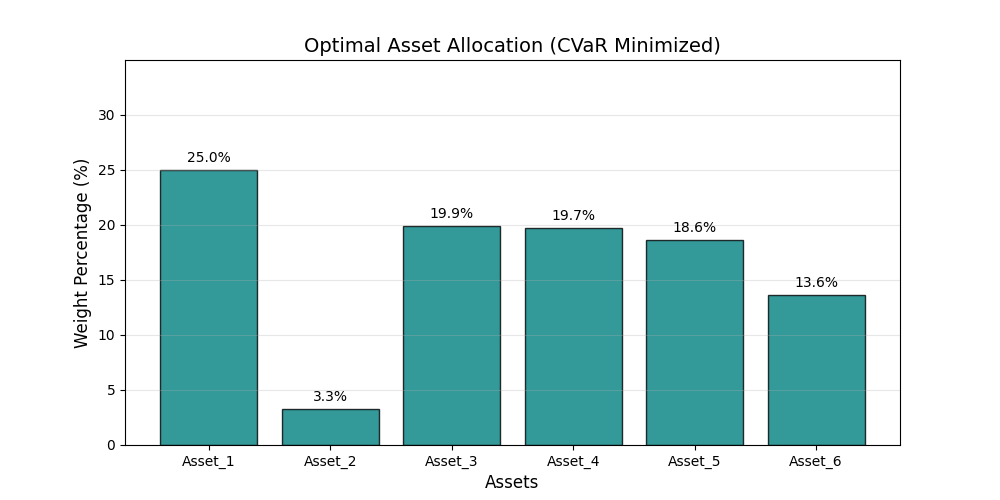

# CVaR-Optimization: Reproducing Rockafellar & Uryasev

This repository is a first-principles reproduction of the seminal paper "Optimization of Conditional Value-at-Risk" by R. Tyrrell Rockafellar and Stanislav Uryasev. The goal is to demonstrate a robust methodology for minimizing Conditional Value-at-Risk (CVaR)—also known as Expected Shortfall—rather than the traditional, non-convex Value-at-Risk (VaR).

## Requirements

Python 3 installation with the numpy and scipy packages installed.
To run, enter the project root in an environment with the previously mentioned packages installed. Then execute the following on your terminal or command line:

```
python3 main.py
```

## Why CVaR?

While VaR represents a specific "energy threshold" of loss, it fails to account for the "fat tails" of the distribution (the severity of losses beyond the threshold). From a dynamical systems perspective, CVaR provides a more stable objective function for risk management because it is sub-additive and convex, allowing for efficient optimization via linear programming.
Core Mathematical Implementation

The engine of this reproduction is the minimization of the auxiliary function Fβ​(x,α):
Fβ(x,α)=α+q(1−β)1​k=1∑q​[f(x,yk​)−α]+

Where:

    x: The portfolio weights (the "state" of our system).

    α: The Value-at-Risk (the threshold).

    f(x,y): The loss function (the "Hamiltonian" of our financial system).

    [⋅]+: The rectifier function, ensuring we only account for losses exceeding the threshold.

## Results


### Figure 1: Portfolio Loss Distribution and Expected Shortfall (β=0.95)


This figure illustrates the probability density of simulated portfolio losses generated via a Multivariate Student-T distribution (df=3). The horizontal axis represents the magnitude of loss (where positive values denote a decrease in portfolio value), and the vertical axis represents frequency across 5,000 scenarios.

The dashed vertical line marks the Value-at-Risk (VaR) at the 95th percentile, identifying the threshold beyond which only 5% of potential losses occur. The region shaded in salmon represents the "Tail Risk" or the CVaR zone. The solid dark red line indicates the Conditional Value-at-Risk (CVaR), calculated as the expected value of all losses within this tail. The significant distance between the VaR and CVaR lines highlights the impact of "fat tails" (kurtosis), demonstrating that extreme market events in this model carry substantially higher risk than a standard Gaussian assumption would suggest.


### Figure 2: Convexity Analysis of the Fβ Objective Function



This plot provides numerical validation of Theorem 1 from the Rockafellar & Uryasev (2000) framework. It depicts the auxiliary objective function Fβ​(x,α) mapped against a range of threshold values (α) for a fixed set of optimal weights (x).

The resulting curve exhibits a smooth, strictly convex geometry, confirming that the problem is well-posed for minimization via convex programming. The gold marker identifies the global minimum of the function. Per the paper’s derivation, the α-coordinate at this minimum corresponds to the Value-at-Risk, while the corresponding function value (y-axis) represents the minimized CVaR. This visualization serves as a proof of convergence, ensuring that the solver has successfully identified the "ground state" of the portfolio's risk surface.

### Figure 3: Optimal Asset Allocation (CVaR Minimized)



This bar chart displays the final "Ground State" configuration of the portfolio after simultaneous VaR/CVaR optimization. The vertical axis shows the percentage allocation for each of the simulated assets.

The distribution reflects the optimizer's response to the underlying correlations and variances of the Student-T scenarios. By minimizing the expected shortfall rather than simple variance, the model has allocated capital to assets that demonstrate a lower frequency of "extreme" negative outliers in the tail of the distribution. This configuration strictly honors the primary constraints of the system: all weights are non-negative (no short-selling), and the total capital allocation sums to exactly 100%.